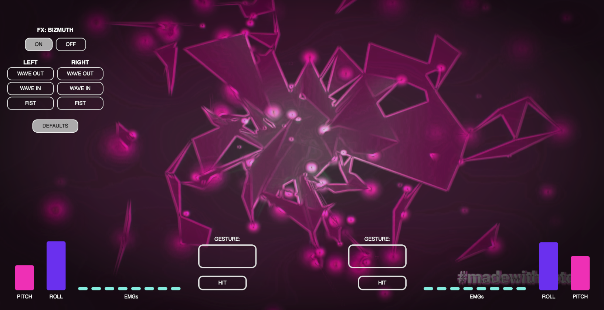

# EventStream Overlay

Requirements: display a UI that shows various sensor data, such as EMGs/electromyography, gesture recognition, accelerometers, gyroscope data, and the status of various buttons from a third-party application as a browser overlay that can be used for various live broadcast applications and situations.

The goal of this project is to provide user feedback to someone using various biosensors who must see that sensor data, such as the pitch, roll, gesture of a hand, etc., and how it effects a 3D environment or object, such as a particle system. This UI is also beneficial to a viewer or audience, as they see what the user sees in real time, and can intuitively understand that the person is actively controlling the 3D object/particle system and its environment.

## Technologies used:

Front-end: Native DOM scripting and vanilla CSS. No further technologies are needed to meet the project goals, with the additional benefit that no further dependencies keeps the overlay highly portable, backward-compatible, and lightweight.

Back-end: A small Node.js server that handles protocol intercept from third-party applications, and pushes this information in real-time to the front-end, using a Node.js EventStream API.

## Example Screenshot

## Roadmap

Additional UI elements to represent the state of third-party applications.

